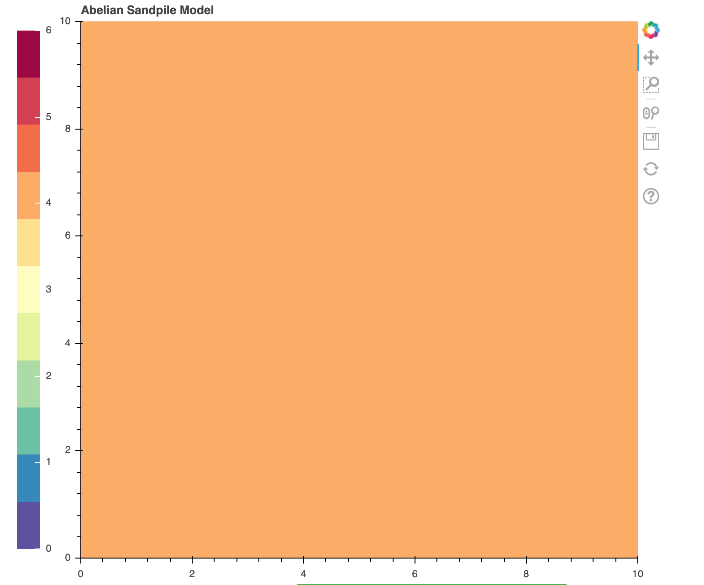

# cpp-final-project Jiale Zhu ,Kangan Hu
## How to use?
### after running the command make, you should use command:
##### ./main.exe S N 
### for instance
##### ./main.exe 10 150 
### to let program use function generateSandpile to generate a SxS random sandpile, S means the size of sandpile, N means how many sand.or you use command:
##### ./main.exe filename
### to let program use function readASandpile to read a file and gerenate a sandpile, for instance 
##### ./main.exe data/sandpile_100x100_triangles.dat

## Detail:
There are three parts of this project: the main.cpp to focus the algorithm of the abelian sandpile simulation, the sandpile.cpp to cope with the stable of certain sandpile and the make_sandpile.cpp to deal with the construction of sandpile from certain parameters. \
For the algorithm of the sandpile collapsing, we use two matrices. One to represent the current state of sandpile and one to store the next moment of the sandpile.

## Challenges encountered
when we start to do the project, the first function we try to complete is generateSandpile. We create the sandpile by Sandpile sp(S); the vscode could compile the file to main.exe, but when we try to use 
##### ./main.exe, 
it outputs a very strange message
##### segmentation fault
We spent long time on fixing it, finally we knew we could create the sandpile by Sandpile sp to avoid this situation.

## Results:

	<h3>Initial frame of sandpile_10x10_4.dat</h3>
	
	<h3>Final Results</h3>
	

## Possible Improvements:
We try to decrese the confusion about the relation of two consective frame so that we create two matrix to store their information seperately. However, by comparion to the one matrix method, it seems to have more iterations. Therefore, using one matrix to store the change of sandpile will save both memory and times.
